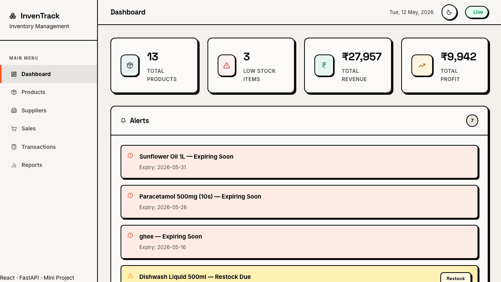
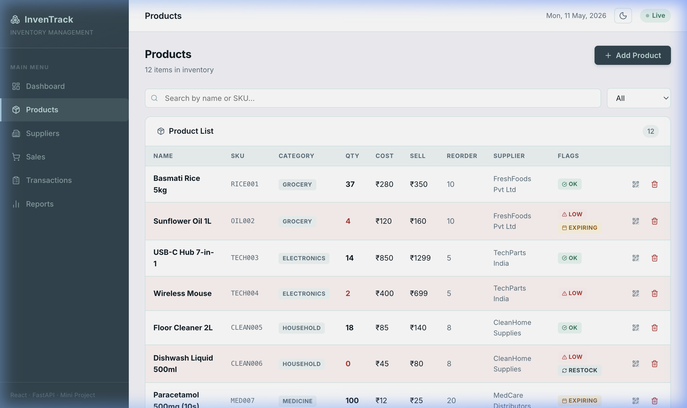
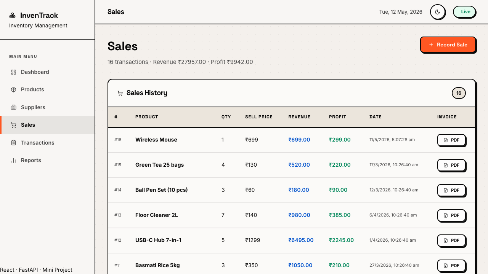
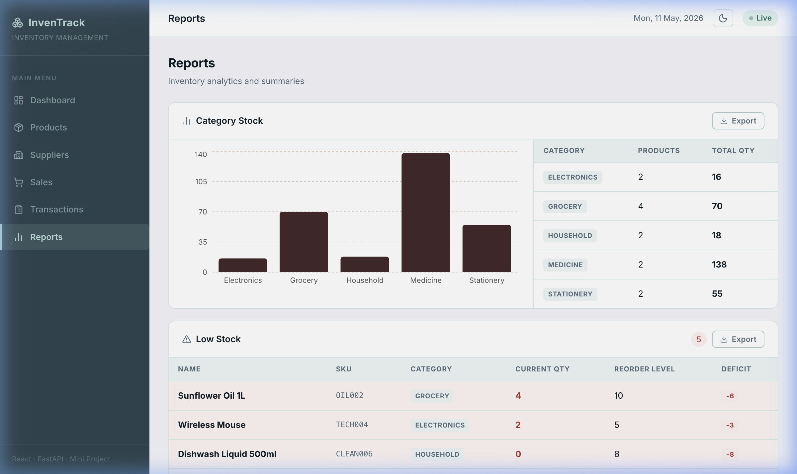
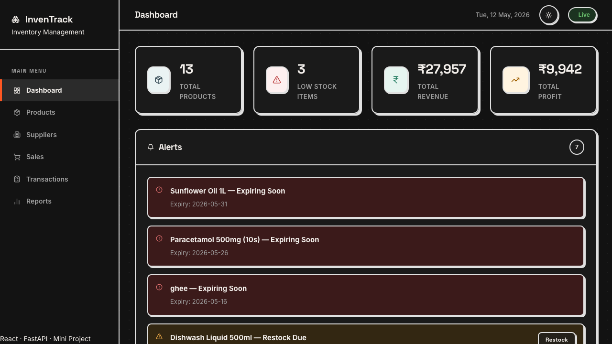

# InvenTrack — Inventory Management System

> A full-stack inventory management web application built with **React + FastAPI**, designed for small businesses to track stock, suppliers, sales, and generate reports — all in a clean, minimalist UI.

### 🚀 Live Demo

| Service | URL |
|---------|-----|
| **Frontend** (Vercel) | https://frontend-mu-nine-41.vercel.app |
| **Backend API** (Railway) | https://react-mini-project-production.up.railway.app |
| **API Docs** (Swagger) | https://react-mini-project-production.up.railway.app/docs |

---

## Screenshots

### Dashboard — KPIs, Smart Insights & Alerts


### Products — Stock Table with QR & Low-Stock Badges


### Sales — Record Sales & Download PDF Invoices


### Reports — Charts, Category Stock & CSV Export


### Dark Mode


---

## Table of Contents

1. [Project Overview](#project-overview)
2. [Tech Stack](#tech-stack)
3. [Project Structure](#project-structure)
4. [Required Features](#required-features)
5. [Extra Features Added](#extra-features-added)
6. [Installation & Setup](#installation--setup)
7. [Running the App](#running-the-app)
8. [Deployment](#deployment)
9. [API Endpoints](#api-endpoints)
10. [Database Schema](#database-schema)
11. [Design System](#design-system)
12. [Business Logic & Validation](#business-logic--validation)

---

## Project Overview

InvenTrack is a full-stack inventory management system that helps small businesses:
- Keep track of product stock levels in real time
- Monitor supplier relationships
- Record and analyze sales transactions
- Generate inventory and profit reports
- Receive intelligent alerts before stock runs out

Built as a mini-project using **React (Vite)** on the frontend and **FastAPI + SQLAlchemy + SQLite** on the backend.

---

## Tech Stack

| Layer     | Technology                          |
|-----------|-------------------------------------|
| Frontend  | React 18, Vite, React Router DOM    |
| Styling   | Vanilla CSS (custom design system)  |
| Icons     | Lucide React                        |
| Charts    | Recharts                            |
| QR Codes  | qrcode.react                        |
| Backend   | FastAPI (Python)                    |
| ORM       | SQLAlchemy                          |
| Database  | SQLite                              |
| PDF Gen   | ReportLab                           |
| HTTP      | Axios                               |
| Hosting   | Vercel (frontend) + Railway (backend) |

---

## Project Structure

```
react-mini-project/
├── backend/
│   ├── main.py              # FastAPI app entry point, CORS, router registration
│   ├── models.py            # SQLAlchemy ORM models (Product, Supplier, Sale, etc.)
│   ├── schemas.py           # Pydantic request/response schemas
│   ├── crud.py              # All database query functions (business logic)
│   ├── database.py          # DB engine + session setup
│   ├── seed.py              # Seeds 12 products, 5 suppliers, 15 sales, logs
│   ├── requirements.txt     # Python dependencies
│   └── routers/
│       ├── products.py      # CRUD for products
│       ├── suppliers.py     # CRUD for suppliers
│       ├── sales.py         # Record sales, list sales history
│       ├── transactions.py  # Audit/transaction log
│       ├── dashboard.py     # KPI summary, alerts
│       ├── reports.py       # Category stock, low-stock, profit, AI insights
│       └── invoices.py      # PDF invoice generation (ReportLab)
│
└── frontend/
    ├── index.html
    ├── vite.config.js
    ├── package.json
    └── src/
        ├── App.jsx              # Root, dark mode state, routing
        ├── index.css            # Complete design system (700+ lines)
        ├── api/
        │   └── api.js           # Axios API client for all endpoints
        ├── components/
        │   ├── Sidebar.jsx      # Navigation sidebar with Lucide icons
        │   ├── Header.jsx       # Topbar with dark/light mode toggle
        │   ├── StatCard.jsx     # Animated KPI stat card
        │   ├── AlertPanel.jsx   # Expiry / restock alert row
        │   └── QRModal.jsx      # QR code modal with download
        └── pages/
            ├── Dashboard.jsx    # KPIs, AI insights, alerts, charts
            ├── Products.jsx     # Product list, add, delete, QR
            ├── Suppliers.jsx    # Supplier cards, add, delete
            ├── Sales.jsx        # Record sales, PDF invoice download
            ├── Transactions.jsx # Audit log table
            └── Reports.jsx      # Charts, low-stock table, CSV export
```

---

## Required Features

These 8 features were the core requirements of the project:

### 1. Product List with Quantities
- Full product table on the **Products** page showing: Name, SKU, Category, Quantity, Cost Price, Selling Price, Reorder Level, Supplier, and Status flags
- Quantities shown prominently; low quantities highlighted in **red text**
- Search by name or SKU; filter by category dropdown
- 12 sample products seeded across 5 categories (Grocery, Electronics, Household, Medicine, Stationery)

### 2. Low-Stock Highlight Alerts
- Products at or below their `reorder_level` are flagged with a **LOW** badge (orange)
- These rows are highlighted with a red background tint in the product table
- The **Dashboard** shows an Alerts panel listing all low-stock and expiring products
- The **Reports** page has a dedicated Low-Stock table with a **Deficit** column (qty − reorder level)

### 3. Sales and Profit Tracking
- The **Sales** page records every transaction with: product name, quantity sold, selling price, revenue, profit, and timestamp
- Total revenue and profit are shown in the page subtitle (live totals)
- Dashboard KPI cards show **Total Revenue** and **Total Profit** at a glance
- Sales history is sorted newest-first with full financial breakdown per row

### 4. Supplier Contact List
- The **Suppliers** page displays all suppliers as cards with: company name, contact person, phone, email, address, and notes
- Suppliers link to products (each product has an assigned supplier)
- Add and delete suppliers via a form with validation

### 5. Category-wise Stock View
- The **Reports** page shows a **Category Stock** bar chart (via Recharts) grouping total units by category
- A summary table lists: Category, Number of Products, Total Qty
- Categories in the dataset: Grocery, Electronics, Household, Medicine, Stationery
- Filter on the Products page also supports category-based filtering

### 6. Product Addition and Deletion
- "Add Product" button opens an inline form with fields: Name, SKU, Category, Quantity, Cost Price, Selling Price, Reorder Level, Supplier, Expiry Date, Restock Date
- Client-side validation prevents empty required fields or negative quantities
- Backend also validates all fields via Pydantic schemas
- Delete button (with browser confirm dialog) removes a product and logs the action

### 7. Transaction Logs
- Every product addition, deletion, and sale is logged in the `transaction_logs` table
- The **Transactions** page shows a full audit log: action type, product name, details, and timestamp
- Action types include: `PRODUCT_ADDED`, `PRODUCT_DELETED`, `STOCK_UPDATED`, `SALE_RECORDED`
- Logs are sorted newest-first

### 8. Basic Inventory Reports
- **Category Stock Report**: bar chart + summary table grouped by category
- **Low-Stock Report**: table of all products below reorder level with deficit column, exportable to CSV
- **Profit Summary**: monthly revenue vs profit chart (line chart, Recharts)
- Export buttons on both the Category Stock and Low-Stock sections download CSV files

---

## Extra Features Added

Beyond the 8 required features, the following were added:

### 9. Expiry / Restock Reminder System *(from project spec)*
- Products optionally store an `expiry_date` and `restock_date`
- Dashboard Alerts panel shows:
  - **"Expiring Soon"** — products with expiry within 30 days (red, clock icon)
  - **"Restock Due"** — products with restock date within 7 days (orange, triangle icon)
- Products page shows **EXPIRING** and **RESTOCK** badges alongside **OK** and **LOW** badges
- Fully integrated: add expiry/restock dates when creating a product

### 10. PDF Invoice Generation
- Every sale entry on the Sales page has a **PDF** button
- Clicking it calls `GET /invoices/{sale_id}` and downloads a branded A4 PDF
- PDF includes: InvenTrack header, invoice number, date, product + supplier details, itemized sale table, revenue/cost/profit/margin summary, and footer
- Generated server-side using **ReportLab** — no browser print required

### 11. Dark / Light Mode Toggle
- Complete CSS variables setup for deep dark mode, transforming the neo-brutalist backgrounds to high-contrast, dark-slate variants.
- State persists via `localStorage`.

### 12. Inline Restock Action
- Directly restock products from the Dashboard warning panels and smart insights.
- Opens a beautiful glassmorphic modal to specify the quantity.
- Dynamically updates stock limits and re-triggers backend insights instantly.

### 13. QR Code Generator
- Small QR icon button appears on every row in the Products table
- Opens a modal with a 200×200 QR code rendered in the brand teal color
- QR encodes: `{ name, sku, category, qty }` — scannable by any phone camera or barcode scanner
- **Download PNG** button saves the QR code as a high-res image file
- Useful for printing and attaching to physical product labels or shelves

### 14. AI Smart Insights (Stockout Prediction)
- Backend calculates sales velocity for each product: total units sold in last 30 days ÷ 30 = avg daily sales
- Predicts how many days of current stock remain: `quantity ÷ avg_daily_sales`
- Results shown on Dashboard below KPI cards as the **Smart Insights** panel
- Three urgency levels:
  - 🔴 **Critical** (≤ 3 days) — "Stock critically low — runs out in ~N day(s)!"
  - 🟡 **Warning** (≤ 7 days) — "Will run out in ~N days at current sales rate."
  - 🔵 **Info** (≤ 21 days) — "~N days of stock remaining."
- Sorted most-urgent first; only shows products with recent sales history

### 15. Animated Stat Counters
- Dashboard KPI cards count up from 0 to their target value on page load
- Handles both plain numbers (e.g. `12`) and currency-prefixed values (e.g. `₹27,258`)
- Uses a custom React hook with `setInterval` — no external animation library

### 16. Stock Validation (Buy Guard)
- **Frontend**: Sales form shows a "Max: N" hint on the quantity field; submitting more than available stock shows an error without calling the API
- **Backend**: `crud.py` double-validates: rejects qty ≤ 0 and qty > current stock
- Error message from backend is specific: `"Insufficient stock. Only N unit(s) available."`
- Prevents any negative inventory state

### 17. CSV Export
- Reports page has **Export** buttons on the Category Stock and Low-Stock sections
- Downloads a properly formatted `.csv` file named with a timestamp
- Works client-side — no backend call needed

---

## Installation & Setup

### Prerequisites
- Python 3.9+ 
- Node.js 18+
- npm

### Backend Setup

```bash
cd backend

# Create and activate virtual environment
python3 -m venv venv
source venv/bin/activate        # Mac/Linux
# venv\Scripts\activate         # Windows

# Install Python dependencies
pip install -r requirements.txt

# Seed the database with sample data (run only once)
python seed.py
```

### Frontend Setup

```bash
cd frontend

# Install npm packages
npm install
```

---

## Running the App

**You need 2 terminals open simultaneously.**

### Terminal 1 — Backend

```bash
cd backend
source venv/bin/activate
uvicorn main:app --reload --reload-dir .
```

> `--reload-dir .` prevents uvicorn from watching the `venv/` folder, which would cause constant unnecessary restarts.

Backend runs at: **http://localhost:8000**  
Interactive API docs: **http://localhost:8000/docs**

### Terminal 2 — Frontend

```bash
cd frontend
npm run dev
```

Frontend runs at: **http://localhost:5173** (or **5174** if 5173 is busy)

---

## Deployment

The app is deployed on two platforms:

| Part | Platform | Why |
|------|----------|-----|
| Frontend (React/Vite) | **Vercel** | Optimized for static/SSG builds, auto-deploys from GitHub |
| Backend (FastAPI + SQLite) | **Railway** | Persistent VM — SQLite works, Python supported natively |

### How Auto-Deploy Works
Every `git push` to the `main` branch triggers:
- **Vercel** rebuilds and redeploys the frontend automatically
- **Railway** rebuilds and restarts the backend automatically

### Auto-Seeding on Railway
Since Railway's filesystem is ephemeral (resets on each deploy), the backend uses a **FastAPI lifespan startup event** to auto-seed the database:
- On every startup, if fewer than 5 products are found in the DB → wipes and re-seeds all demo data
- If 5+ products exist → skips seeding (preserves user-added data)
- No manual `python seed.py` step needed on Railway

### Deploy Your Own Copy

**Backend → Railway:**
1. Go to [railway.app](https://railway.app) → New Project → Deploy from GitHub
2. Select your fork of this repo
3. Set **Root Directory** → `backend`
4. Railway auto-detects Python from `requirements.txt` and starts via `Procfile`
5. Generate a public domain in Settings → Networking

**Frontend → Vercel:**
```bash
# Install Vercel CLI
npm i -g vercel

# From the frontend directory:
vercel link --yes
echo "https://your-railway-url.up.railway.app" | vercel env add VITE_API_URL production --yes
vercel --prod --yes
```

---

## API Endpoints

### Products
| Method | Endpoint | Description |
|--------|----------|-------------|
| GET | `/products/` | List all products |
| POST | `/products/` | Add a new product |
| DELETE | `/products/{id}` | Delete a product |
| PATCH | `/products/{id}/restock`| Inline restocking |

### Suppliers
| Method | Endpoint | Description |
|--------|----------|-------------|
| GET | `/suppliers/` | List all suppliers |
| POST | `/suppliers/` | Add a new supplier |
| DELETE | `/suppliers/{id}` | Delete a supplier |

### Sales
| Method | Endpoint | Description |
|--------|----------|-------------|
| GET | `/sales/` | List all sales |
| POST | `/sales/` | Record a new sale |

### Dashboard
| Method | Endpoint | Description |
|--------|----------|-------------|
| GET | `/dashboard/` | KPIs, low-stock alerts, expiry/restock reminders |

### Reports
| Method | Endpoint | Description |
|--------|----------|-------------|
| GET | `/reports/category-stock` | Stock totals grouped by category |
| GET | `/reports/low-stock` | Products below reorder level |
| GET | `/reports/profit-summary` | Monthly revenue and profit breakdown |
| GET | `/reports/insights` | AI stockout predictions (30-day velocity) |

### Invoices
| Method | Endpoint | Description |
|--------|----------|-------------|
| GET | `/invoices/{sale_id}` | Download PDF invoice for a sale |

### Transactions
| Method | Endpoint | Description |
|--------|----------|-------------|
| GET | `/transactions/` | Full audit log |

---

## Database Schema

### `products`
| Column | Type | Notes |
|--------|------|-------|
| id | Integer | Primary key |
| name | String | Product name |
| sku | String | Unique stock-keeping unit |
| category | String | Grocery, Electronics, etc. |
| quantity | Integer | Current stock level |
| cost_price | Float | Purchase price per unit |
| selling_price | Float | Sale price per unit |
| reorder_level | Integer | Triggers low-stock alert |
| supplier_id | FK → suppliers | Linked supplier |
| expiry_date | Date | Optional; triggers EXPIRING badge |
| restock_date | Date | Optional; triggers RESTOCK badge |

### `suppliers`
| Column | Type | Notes |
|--------|------|-------|
| id | Integer | Primary key |
| name | String | Company name |
| contact_person | String | |
| phone | String | |
| email | String | |
| address | String | |
| notes | String | Optional |

### `sales`
| Column | Type | Notes |
|--------|------|-------|
| id | Integer | Primary key |
| product_id | FK → products | |
| quantity_sold | Integer | Units sold |
| cost_price_at_sale | Float | Snapshot of cost at time of sale |
| selling_price_at_sale | Float | Snapshot of selling price |
| total_sale_amount | Float | quantity × selling_price |
| total_profit | Float | (selling − cost) × quantity |
| sold_at | DateTime | Timestamp |

### `transaction_logs`
| Column | Type | Notes |
|--------|------|-------|
| id | Integer | Primary key |
| action | String | PRODUCT_ADDED, SALE_RECORDED, etc. |
| product_name | String | |
| details | String | Human-readable description |
| timestamp | DateTime | |

---

## Design System (Neo-Brutalism + Glassmorphism)

The UI was overhauled to break away from standard, boring "flat" designs and adopt a highly tactile, human-centric visual language.

### Core Traits
1. **Neo-Brutalism:** Hard 2px solid dark borders, distinct blocky drop shadows (`4px 4px 0 #000`), and a raw, structural feel.
2. **Glassmorphism:** The sidebar, topbar, and modals utilize semi-transparent backgrounds with deep background blurring (`backdrop-filter: blur(16px)`).
3. **Typography:** Primary headers and structural UI elements use **Space Grotesk** for a bold, technical aesthetic, paired with **Inter** for legible body copy.
4. **Textures:** A subtle radial-gradient dotted background pattern gives the page a "blueprint" or "canvas" texture.

### Color Palette
| Token | Hex | Usage |
|-------|-----|-------|
| Warm Cream | `#F4F0EC` | Primary Page Background |
| Ink Black | `#0A0A0A` | Text, borders, and hard drop-shadows |
| Punchy Orange | `#FF5722` | Primary brand accent and interactive buttons |
| Glass White | `rgba(255,255,255,0.65)`| Card and modal backgrounds |

### Typography
- Font: **Inter** (Google Fonts) with system-ui fallback
- Heading sizes: 19px (page), 15px (topbar), 13.5px (card headers)
- Body: 13–13.5px; Labels: 10.5–11px uppercase with letter-spacing

### Component Patterns
- **Cards**: white background, teal-tinted border, 10px radius, hover shadow lift
- **Buttons**: primary (dark teal + shadow), outline (teal border), ghost (transparent)
- **Badges**: pill-shaped, color-coded (success/warning/danger/info)
- **Tables**: clean borders, teal hover, red-tinted low-stock rows
- **Stat Cards**: colored left border that intensifies on hover

---

## Business Logic & Validation

| Rule | Where enforced |
|------|----------------|
| Cannot sell more units than in stock | Frontend form + `crud.py` backend |
| Quantity must be ≥ 1 for a sale | Frontend form + `crud.py` backend |
| Product SKU must be unique | Database unique constraint |
| Selling price must be positive | Pydantic schema validation |
| PDF invoice only exists for valid sale IDs | 404 returned if sale not found |
| Seed data never creates negative stock | `make_sale()` in `seed.py` caps qty at available |
| Stockout prediction only for products with recent sales | `avg_daily > 0` guard in `get_insights()` |
